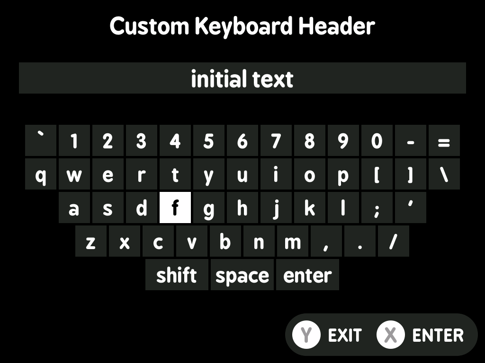
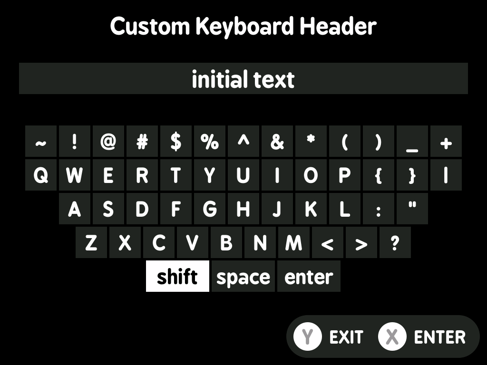

# minui keyboard

This is a minui keyboard. It allows people to type values into a text field and then writes that to stdout or a file.

## LessUI Integration

This utility has been integrated into LessUI as a system utility available to all paks.

**Changes made for LessUI:**
- Adapted makefile to use LessUI's workspace structure
- References LessUI's `workspace/all/common/` shared code
- Built as part of the standard LessUI build process
- Deployed to `build/SYSTEM/<platform>/bin/minui-keyboard`

**Building:**
```bash
make build PLATFORM=miyoomini  # Builds as part of workspace/all/utils/
```

**Original source:** https://github.com/josegonzalez/minui-keyboard

**Forked from commit:** `f4a88073aa64479bc6137ad49362b024ca34c6b1`

## Requirements

- A minui union toolchain
- Docker (this folder is assumed to be the contents of the toolchain workspace directory)
- `make`

## Usage

This tool is designed to be used as part of a larger minui app. It only supports an english keyboard layout, and has support for capitalized keys as well as many common special characters.

```shell
# default behavior is to write to stdout
minui-keyboard

# write to a file
minui-keyboard > output.txt

# capture output to a variable for use in a shell script
output=$(minui-keyboard)

# you can also specify a location to write to
# the internal minui sdk sometimes writes to stdout
# depending on platform, so this may be useful
minui-keyboard --write-location file.txt

# specify a title for the keyboard page
# by default, the title is empty
minui-keyboard --title "Some Header"

# hide the wifi and battery icons
# by default, the hardware group is not shown
minui-keyboard --show-hardware-group

# specify an initial value for the text field
minui-keyboard --initial-value "Some Initial Value"

# minui-keyboard will auto-sleep like the normal minui menu by default
# this can be disabled by setting the --disable-auto-sleep flag
minui-keyboard --disable-auto-sleep
```

### Exit Codes

- 0: Success
- 1: Error
- 2: User cancelled with Y button
- 3: User cancelled with Menu button
- 130: Ctrl+C

## Screenshots

  
