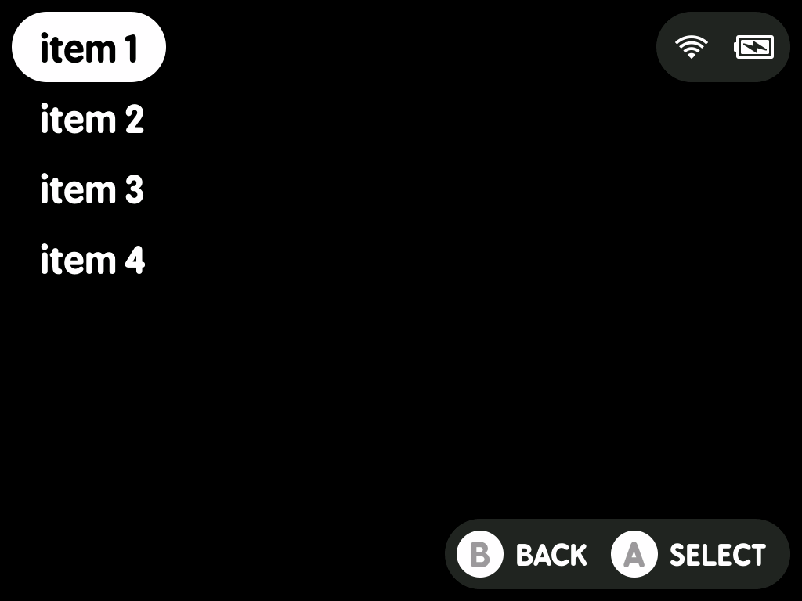
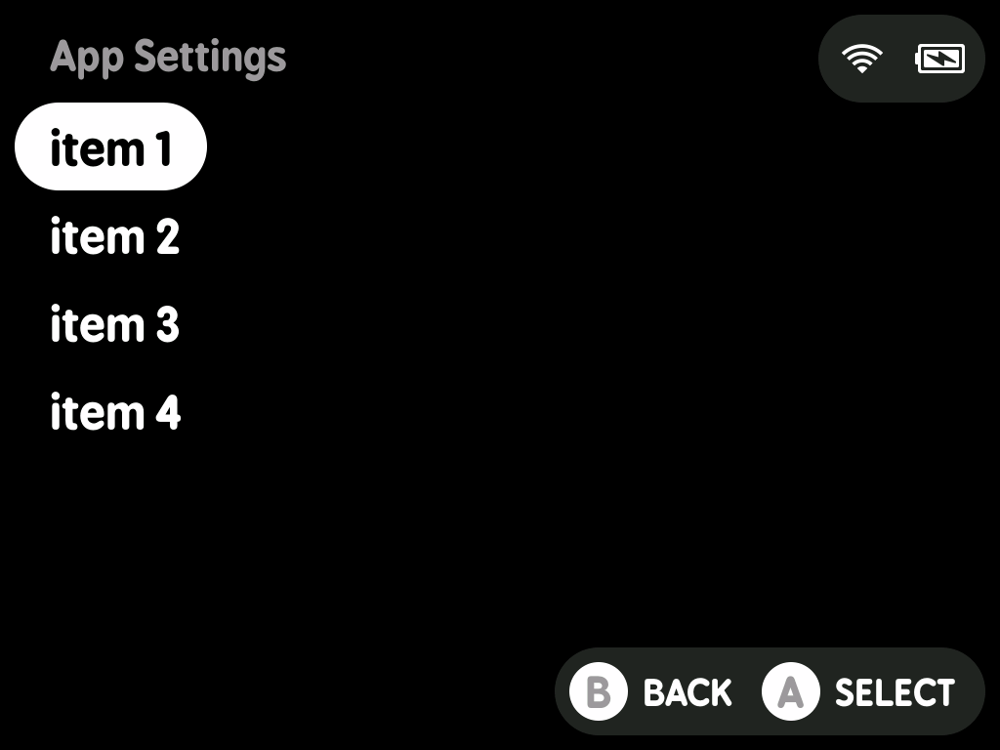
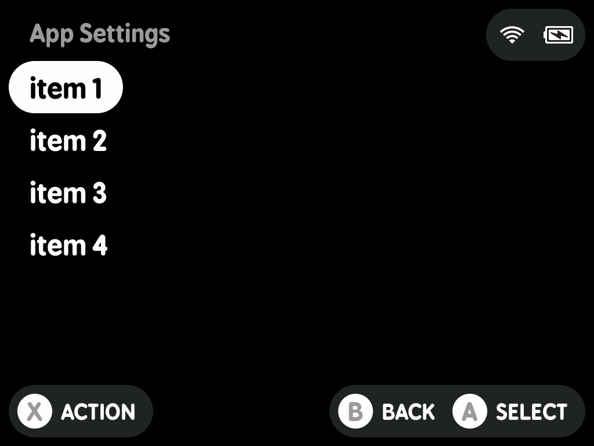
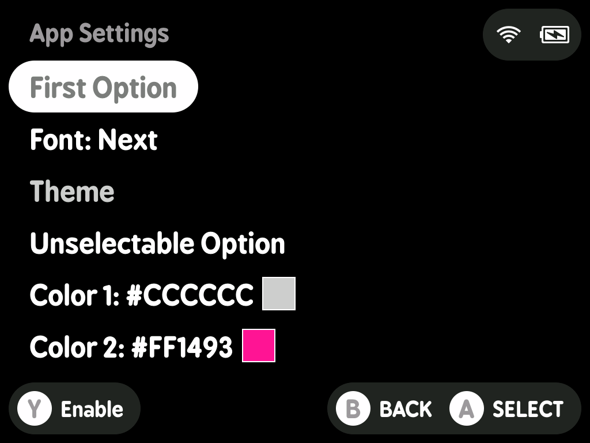
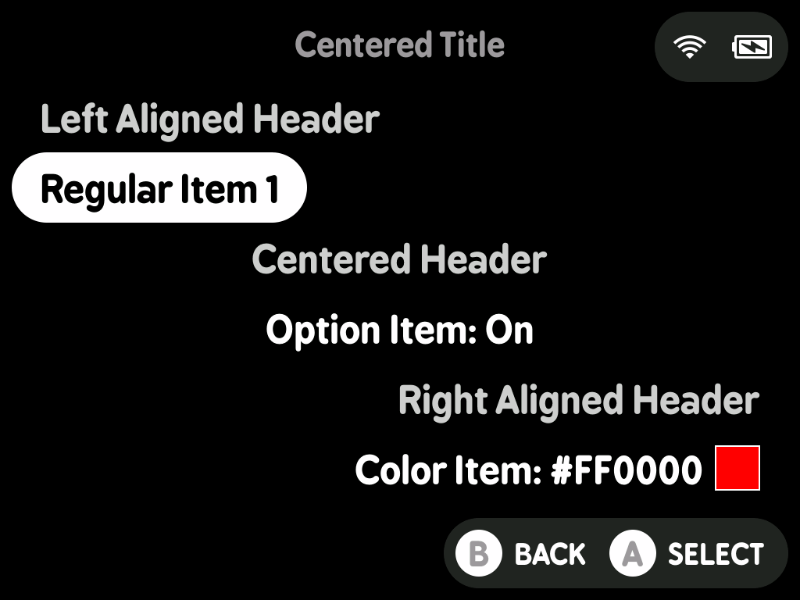

# minui list

This is a minui list app. It allows people to show a list of items or settings and then writes the selected item or state to stdout.

## LessUI Integration

This utility has been integrated into LessUI as a system utility available to all paks.

**Changes made for LessUI:**
- Upgraded to use LessUI's DP (Display Points) system for cross-device scaling
- Replaced undefined constants (MAIN_ROW_COUNT, PILL_SIZE, etc.) with `ui.*` equivalents
- Adapted makefile to use LessUI's workspace structure
- References LessUI's `workspace/all/common/` shared code
- Built as part of the standard LessUI build process
- Deployed to `build/SYSTEM/<platform>/bin/minui-list`

**Building:**
```bash
make build PLATFORM=miyoomini  # Builds as part of workspace/all/utils/
```

**Original source:** https://github.com/josegonzalez/minui-list

**Forked from commit:** `f172a8efd0f79bf48b2b81d6a8f881580002cce4`

## Requirements

- A minui union toolchain
- Docker (this folder is assumed to be the contents of the toolchain workspace directory)
- `make`

## Usage

This tool is designed to be used as part of a larger minui app.

```shell
# default behavior is to read from a JSON file that contains a list of items at the root
# ["item-1", "item-2", "item-3"]
minui-list --file list.json

# you can also read from a JSON file that containing an object with an array of objects at a specific key
# note that the objects must have a "name" key, which will be used as the item name
# {"items": [{"name": "item-1"}, {"name": "item-2"}, {"name": "item-3"}]}
minui-list --file list.json --item-key "items"

# you can also read from newline-delimited strings by specifying the --format flag
# the default format is "json", but you can also specify "text"
minui-list --format text --file list.txt

# finally, you can read the input from stdin
# this is useful for reading from a pipe or a variable
# it is compatible with both json and text formats
echo -e "item1\nitem2\nitem3" | minui-list --format text --file -

# write the selected item to a file
minui-list --file list.json > output.txt

# or capture output to a variable for use in a shell script
output=$(minui-list --file list.json)

# you can also specify a location to write to
# the internal minui sdk sometimes writes to stdout
# depending on platform, so this may be useful
minui-list --file list.json --write-location file.txt

# background colors and images can be set
# the flags provide defaults, but they can be overriden
# for specific entries via json
minui-list --file list.json --background-color "#ababab"
minui-list --file list.json --background-image "full/path/to/image.png"

# specify a title for the list page
# by default, the title is empty
minui-list --file list.json --title "Some Title"

# specify alignment for the title
# left aligned by default, options are "left", "center", "right"
minui-list --file list.json --title "Centered Title" --title-alignment center

# specify alternative text for the Confirm button
# by default, the Confirm button text is "SELECT"
minui-list --file list.json --confirm-text "CHOOSE"

# specify an alternative button for the Confirm button
# by default, the Confirm button is "A"
# the only buttons supported are "A", "B", "X", and "Y"
minui-list --file list.json --confirm-button "X"

# specify alternative text for the Cancel button
# by default, the Cancel button text is "BACK"
minui-list --file list.json --cancel-text "CANCEL"

# specify an alternative button for the Cancel button
# by default, the Cancel button is "B"
# the only buttons supported are "A", "B", "X", and "Y"
minui-list --file list.json --cancel-button "Y"

# specify a button for the Action Button
# by default, there is no action button
# when set, the default Action button text is "ACTION"
# the only buttons supported are "A", "B", "X", and "Y"
minui-list --file list.json --action-button "X" --action-text "RESUME"

# specify an alternative button for the Enable Button
# by default, the Cancel button is "Y"
# the button text is either "Enable" or "Disable"
# the only buttons supported are "A", "B", "X", and "Y"
minui-list --file list.json --enable-button "Y"

# write the current json state to stdout
# this will _always_ write the current state to stdout
# regardless of exit code
# the index of the selected item will be written
# to the top-level `selected` property
minui-list --file list.json --write-value state

# paths to a custom font (.otf or .ttf) can be specified
# the order of usage is:
#  --font-SIZE > --font-default > built-in minui font
# if the font is missing and is loaded, this will result in an error

# will use the specified font for all text sizes
minui-list --file list.json --font-default full/path/to/font.otf

# will use font-large.ttf for large text
# and the default minui font (BPreplayBold-unhinted.otf) for small text
minui-list --file list.json --font-large path/to/font-large.otf

# will use font.ttf for small text
# and font-large.ttf for large text
minui-list --file list.json --font-default full/path/to/font.otf --font-large path/to/font-large.otf

# will use font.ttf for large text
# and font-small.ttf for small text
minui-list --file list.json --font-default full/path/to/font.otf --font-small path/to/font-small.otf

# hardware hints (power/wifi) are shown by default
# but can be hidden by a flag
# note that the hardware hints are hidden if x/y buttons are displayed
minui-list --file list.json --hide-hardware-group

# minui-list will auto-sleep like the normal minui menu by default
# this can be disabled by setting the --disable-auto-sleep flag
minui-list --file list.json --disable-auto-sleep
```

To create a list of items from newline-delimited strings, you can use jq:

```shell
# create a JSON array from newline-delimited input
echo -e "item1\nitem2\nitem3" | jq -R -s 'split("\n")[:-1]'

# or read from a file containing newline-delimited items
jq -R -s 'split("\n")[:-1]' < items.txt

# or create a JSON array using pure bash
printf '[\n' > list.json
while IFS= read -r line; do
  printf '  "%s",\n' "$line"
done < items.txt | sed '$ s/,$//' >> list.json
printf ']\n' >> list.json
```

### File Formats

#### Text

A newline-delimited file.

```text
item 1
item 2
item 3
```

#### JSON

> [!NOTE]
> If an item is detected as a hex color, a small box showing that color will be shown to the right of the item entry in the list.

##### Array

A json array. May or may not be formatted.

```json
[
  "item 1",
  "item 2",
  "item 3"
]
```

##### Object

A list of objects set at a particular key. May or may not be formatted. Comments are allowed.

```json
{
  "items": [
    {
      "name": "item 1"
    },
    {
      "name": "item 2"
    },
    {
      "name": "item 3"
    }
  ]
}
```

Properties:

- name: (required, type: `string`) the option name
- options: (optional, type: `[]string`, default: `[]`) a list of strings to display as options. The arrow keys can be used to change the selected option, and the confirm button will be hidden if the currently selected option is the same as the default selected option.
- selected: (optional, type: `integer`, default: `0`) the default selected option
- features.alignment: (optional, type: `string`, default: `left`) text alignment: 'left', 'center', or 'right'
- features.background_color: (optional, type: `string`, default: `#000000`) a hexadecimal color
- features.background_image: (optional, type: `string`, default: empty string) a full path to a background image
- features.can_disable: (optional, type: `boolean`, default: `false`) whether or not an option can be enabled or disabled
- features.confirm_text: (optional, type: `string`, default: ``) text to use to override the default confirm text for the entry
- features.disabled: (optional, type: `boolean`, default: `false`) whether the field shows up as enabled or disabled
- features.draw_arrows: (optional, type: `boolean`, default: `false`) whether to show options with arrows around them (hex color boxes will be outside of the arrow)
- features.hide_action: (optional, type: `boolean`, default: `false`) whether to show the action button on this entry or not
- features.hide_cancel: (optional, type: `boolean`, default: `false`) whether to show the cancel button on this entry or not
- features.hide_confirm: (optional, type: `boolean`, default: `false`) whether to show the confirm button on this entry or not
- features.is_header: (optional, type: `boolean`, default: `false`) allows specifying that an item is a header
- features.unselectable: (optional, type: `boolean`, default: `false`) whether an item is selectable or not

Item example:

```json
{
  "name": "item 1",
  "options": [
    "option 1",
    "option 2",
    "option 3"
  ],
  "selected": 1,
  "features": {
    "alignment": "left",
    "can_disable": false,
    "confirm_text": "SAVE",
    "disabled": false,
    "draw_arrows": false,
    "hide_action": false,
    "hide_cancel": false,
    "hide_confirm": false,
    "is_header": false,
    "unselectable": false
  }
}
```

> [!WARNING]
> If items are specified in json format, the item list _must_ have at
> least one selectable, non-header item.
> The `minui-list` binary will exit with an error if that is not the case.

### Exit Codes

- 0: Success (the user selected an item)
- 1: Error
- 2: User cancelled with B button
- 3: User cancelled with Menu button
- 4: User pressed Action button
- 10: Error parsing input
- 11: Error serializing output
- 130: Ctrl+C

## Screenshots

| Name               | Image                                                 |
|--------------------|-------------------------------------------------------|
| No Header          |      |
| Header             |         |
| Header with Action |  |
| JSON Kitchen Sink  |     |
| Aligned Items      |      |
