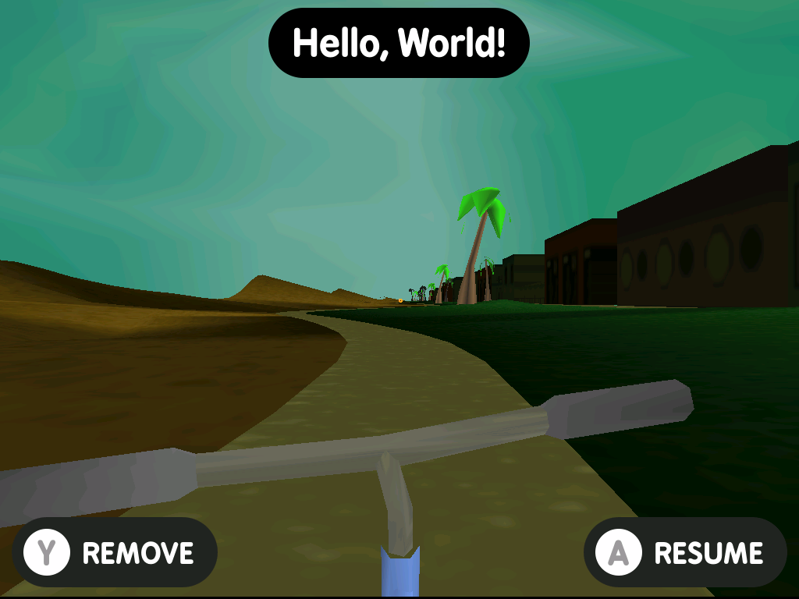
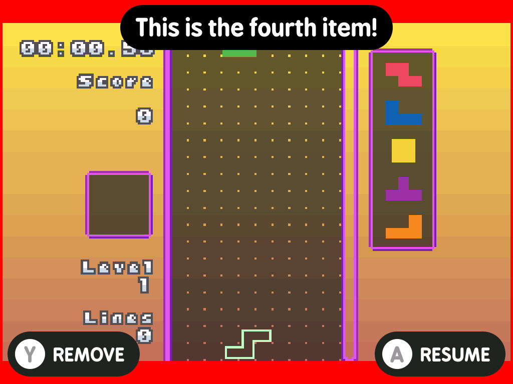
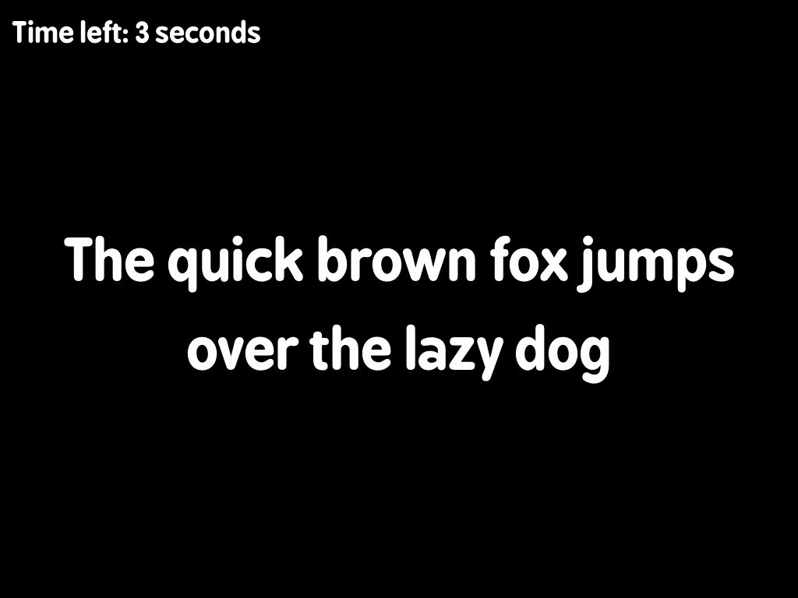

# minui presenter

This is a minui presentation app. It allows displaying messages on the screen with background colors and images.

## LessUI Integration

This utility has been integrated into LessUI as a system utility available to all paks.

**Changes made for LessUI:**
- Upgraded to use LessUI's DP (Display Points) system for cross-device scaling
- Replaced undefined constants (PILL_SIZE, BUTTON_PADDING, etc.) with `ui.*` equivalents
- Replaced `SCALE1()` macro with `DP()` for proper scaling
- Adapted makefile to use LessUI's workspace structure
- References LessUI's `workspace/all/common/` shared code
- Built as part of the standard LessUI build process
- Deployed to `build/SYSTEM/<platform>/bin/minui-presenter`

**Building:**
```bash
make build PLATFORM=miyoomini  # Builds as part of workspace/all/utils/
```

**Original source:** https://github.com/josegonzalez/minui-presenter

**Forked from commit:** `611a1271bb3d52cd9f19f4895042d0aef419c2a4`

## Requirements

- A minui union toolchain
- Docker (this folder is assumed to be the contents of the toolchain workspace directory)
- `make`

## Usage

```shell
minui-presenter --message "The quick brown fox jumps over the lazy dog"
```

### Options

#### Message Display

- `--background-color <hex-color>`: Default background color to use (default: `#000000`).
- `--background-image <path>`: Default background image to use (default: empty string).
- `--message <text>`: Display a single message (default: empty string)
- `--message-alignment <alignment>`: Set message alignment (default: `middle`)
  - Valid values: `top`, `middle`, `bottom`
- `--file <path>`: Path to JSON file containing messages (default: empty string)
- `--item-key <key>`: Key in JSON file containing items array (default: `items`)
- `--quit-after-last-item`: Quit the program after navigating past the last element (default: `false`)
- `--show-pill`: Whether to show the pill by default or not (default: `false`)

> [!IMPORTANT]
> Either the `--message` or `--file` argument must be specified

### Font Configuration

- `--font-default <path>`: Path to custom font file (default: built-in font)
- `--font-size-default <size>`: Font size for messages (default: `FONT_LARGE`)

### Button Configuration

#### Action Button

- `--action-button <button>`: Assign action button (default: none)
- `--action-text <text>`: Text for action button (default: `ACTION`)
- `--action-show`: Show action button (default: `false`)

#### Confirm Button

- `--confirm-button <button>`: Assign confirm button (default: `A`)
- `--confirm-text <text>`: Text for confirm button (default: `SELECT`)
- `--confirm-show`: Show confirm button (default: `false`)

#### Cancel Button

- `--cancel-button <button>`: Assign cancel button (default: `B`)
- `--cancel-text <text>`: Text for cancel button (default: `BACK`)
- `--cancel-show`: Show cancel button (default: `false`)

#### Inaction Button

- `--inaction-button <button>`: Assign inaction button (default: none)
- `--inaction-text <text>`: Text for inaction button (default: `OTHER`)
- `--inaction-show`: Show inaction button (default: `false`)

### Display Options

- `--disable-auto-sleep`: Disables the auto-sleep functionality (default: `false`)
- `--show-hardware-group`: Show hardware information group (default: `false`)
- `--show-time-left`: Show countdown timer (default: `false`)
- `--timeout <seconds>`: Set timeout in seconds (default: `0`, no timeout)

When setting the `--timeout` flag, `minui-presenter` has the following behavior:

- `value < 0`: Will not respond to button presses. This is useful for backgrounding the process and using `killall` to terminate it once another foreground process completes. Sleep will be disabled.
- `value == 0`: Will continue to execute until any of the configured buttons are pressed. Useful for confirmation screens or image galleries. Sleep will be disabled.
- `value > 0`: Will continue to execute until any of the configured buttons are pressed _or_ the configured timeout is reached. Useful for confirmation screens that should only be shown for a maximum amount of time. Sleep is enabled.

### Button Values

> [!NOTE]
> Each hardware button can only be assigned once.

Valid button assignments are:

- `A`: A button
- `B`: B button
- `X`: X button
- `Y`: Y button

When an assigned button is pressed, minui-presenter will exit with the appropriate exit code. Minui-presenter will ignore button presses for the assigned `A`/`X`/`Y` buttons if they are not displayed via the appropriate `show` flag (though will always respect the assigned `B` button).

## Signals

This process handles the following signals:

- `SIGINT`: Exits with Keyboard interrupt (`130`)
- `SIGTERM`: Exits gracefully (`143`)
- `SIGUSR1`: Advances the item state by one or goes to first item if at end of list. Respects the `--quit-after-last-item` flag.

## Exit Codes

- `0`: Success
- `1`: Error
- `2`: Cancel button pressed
- `4`: Action button pressed
- `5`: Inaction button pressed
- `6`: Start button pressed
- `124`: Timeout reached
- `130`: Keyboard interrupt (Ctrl+C)
- `143`: Graceful exit (`SIGTERM`)

## JSON File Format

When using `--file`, the JSON should follow this format:

```json
{
  "items": [
    {
      "text": "Message text",
      "background_image": "path/to/image.png",
      "background_color": "#000000",
      "show_pill": false,
      "alignment": "middle"
    }
  ],
  "selected": 0
}
```

An initial index can be specified via the `selected` key (default: `0`).

When multiple items are displayed, the list can be scrolled using the `LEFT` AND `RIGHT` buttons.

### Item Properties

- `text`: The message to display
- `background_image`: (default: null) Path to background image. Will be stretched to fill screen by aspect ratio. The image will be displayed as soon as it exists.
- `background_color`: (default: `#000000`) Hex color code for background
- `show_pill`: (default: `false`) Whether to show a pill around the text
- `alignment`: (default: `middle`) Message alignment ("top", "middle", "bottom")

## Screenshots

| Name                                           | Image                                                                 |
|------------------------------------------------|-----------------------------------------------------------------------|
| Fullscreen image with Actions                  |  |
| Background color and scaled image with Actions |  |
| Message with Timeout                           |           |
